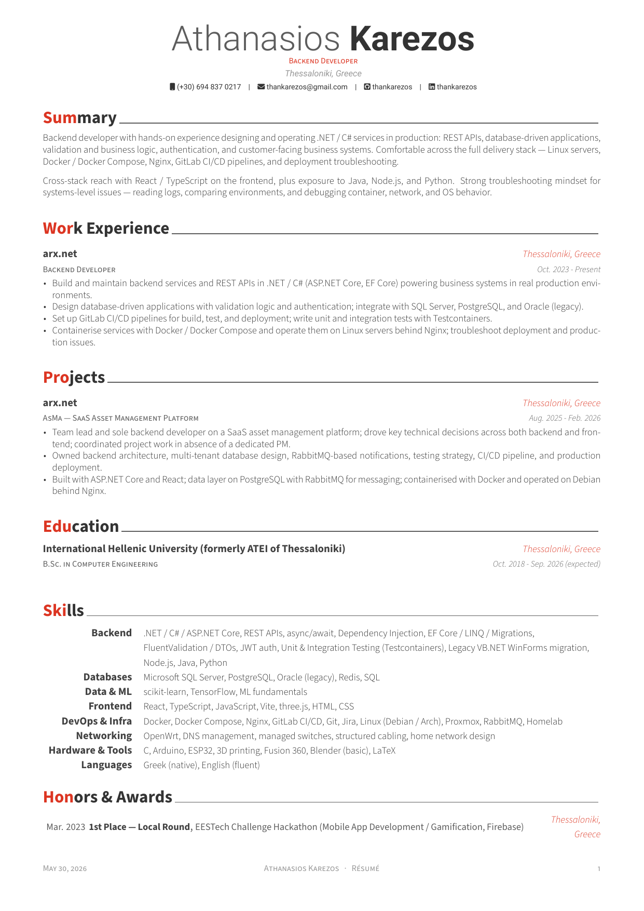
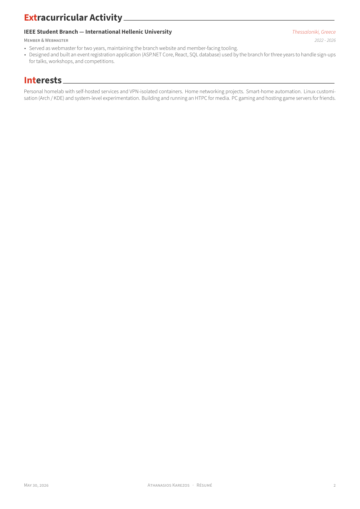

# Athanasios Karezos — CV

My CV, built from the [Awesome-CV](https://github.com/posquit0/Awesome-CV) LaTeX template.

[**Download the PDF**](sections/output/resume-public.pdf)





---

## Building locally

The repo builds two PDFs (all build output goes to `sections/output/`):

- `sections/output/resume.pdf` — full CV with my street address and photo. Uses `sections/secrets.tex` (gitignored). Local-only.
- `sections/output/resume-public.pdf` — city-only version, no street address and no photo. Uses `sections/secrets.example.tex`. This is what ships in the repo and renders above.

```sh
./build.sh           # build both
./build.sh local     # only resume.pdf
./build.sh public    # only resume-public.pdf
```

Requires `xelatex` (TeX Live with `fontawesome6`, Source Sans 3, Roboto, Font Awesome 6 system fonts) and `pdftoppm` (poppler) — the public build auto-regenerates the README PNG previews.

### Building with Docker

No local TeX Live? Build inside a self-contained Alpine + XeLaTeX image (see [`Dockerfile`](Dockerfile)) instead:

```sh
./docker-build.sh           # build both
./docker-build.sh local     # only resume.pdf
./docker-build.sh public    # only resume-public.pdf
```

The script builds the image (cached after the first run), then runs `build.sh` inside it. Your repo is mounted into the container and the build runs as your own user, so the generated PDFs/PNGs land in `sections/` owned by you. Only Docker is required.

## Credits

Built from [Awesome-CV](https://github.com/posquit0/Awesome-CV) by Claud D. Park ([@posquit0](https://github.com/posquit0)). Template is licensed under CC BY-SA 4.0; see [`LICENCE`](LICENCE).
