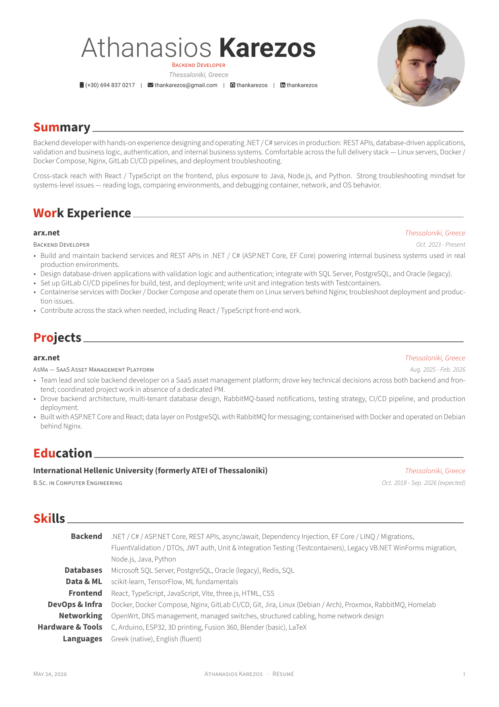
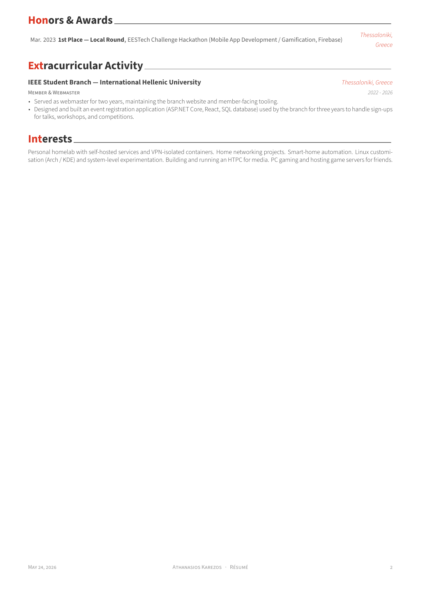

# Athanasios Karezos — CV

My CV, built from the [Awesome-CV](https://github.com/posquit0/Awesome-CV) LaTeX template.

[**Download the PDF**](sections/resume-public.pdf)





---

## Building locally

The repo builds two PDFs:

- `sections/resume.pdf` — full CV with my street address. Uses `sections/secrets.tex` (gitignored). Local-only.
- `sections/resume-public.pdf` — city-only version, no street address. Uses `sections/secrets.example.tex`. This is what ships in the repo and renders above.

```sh
./build.sh           # build both
./build.sh local     # only resume.pdf
./build.sh public    # only resume-public.pdf
```

Requires `xelatex` (TeX Live with `fontawesome6`, Source Sans 3, Roboto, Font Awesome 6 system fonts) and `pdftoppm` (poppler) — the public build auto-regenerates the README PNG previews.

## Credits

Built from [Awesome-CV](https://github.com/posquit0/Awesome-CV) by Claud D. Park ([@posquit0](https://github.com/posquit0)). Template is licensed under CC BY-SA 4.0; see [`LICENCE`](LICENCE).
